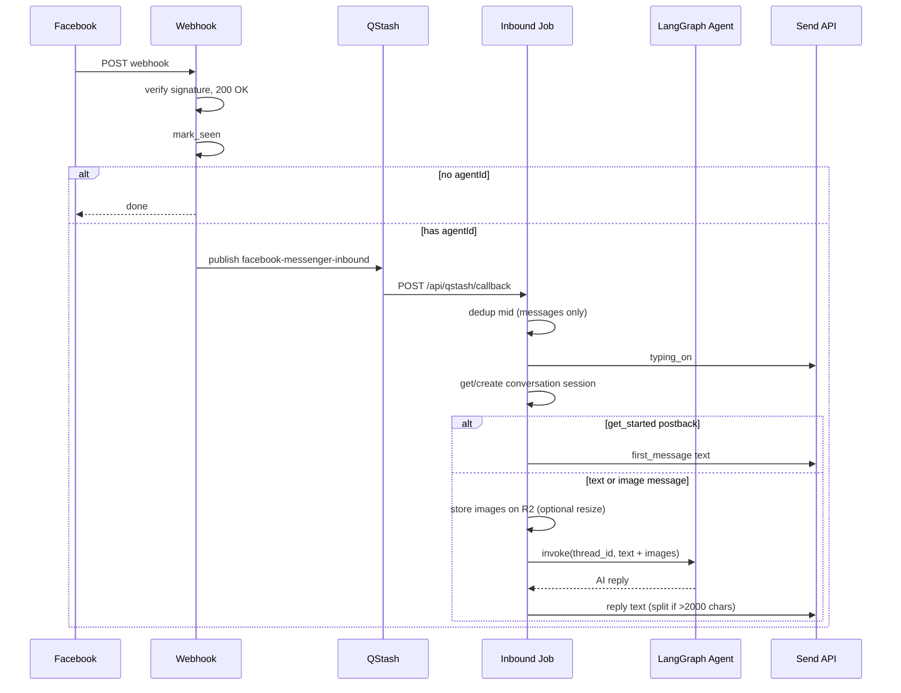

# Facebook Agent Replies

Automated Messenger replies using workspace agents, LangGraph sessions, and QStash async processing.

## Overview

When Facebook sends a webhook event to `/api/webhooks/facebook`:

1. The route verifies the signature and returns `200` immediately.
2. Processing runs in `after()` via `handleFacebookMessengerWebhook`.
3. For each messaging event:
   - Resolve the Facebook Page connection.
   - Always send `mark_seen` to the participant.
   - If the connection has **no assigned agent** → stop (no reply, no QStash job).
   - If an agent is assigned → enqueue a QStash job (`facebook-messenger-inbound`).
4. The QStash callback invokes the agent and sends the reply through the Facebook Send API.

## Decisions implemented

| Decision | Behavior |
| -------- | -------- |
| No assigned agent | `mark_seen` only; no typing indicator, no reply |
| Agent reassignment | All channel `chat_agent_sessions` rows for that connection are deleted; next message creates a fresh session |
| Get Started postback | Always handled when an agent is assigned; sends the agent's `first_message` (or default greeting) without invoking the LLM |
| Async processing | QStash from the first version; webhook never waits for LLM latency |
| Sender actions | Webhook: `mark_seen` on receive; QStash job: `typing_on` before processing; Messenger clears typing when the reply is delivered — `typing_off` only on job failure |
| Inbound images | Download from Facebook → store on R2 → vision via Cloudflare resize URL |

## Data model

### `agents.first_message`

Optional greeting text used for Messenger **Get Started** postbacks. If empty, the default is:

`Hello! How can I help you today?`

### `chat_agent_sessions` (channel rows)

One row per `(connection_id, external_participant_id, chat_env)` — e.g. one Facebook PSID per Page connection with `chat_env = facebook_page`.

- `id` = LangGraph `thread_id` (Postgres checkpointer)
- `agent_id` = agent that owns this session; mismatch with the connection's current agent triggers session reset

### `connection_inbound_dedup`

Stores processed Facebook `mid` values per connection to avoid duplicate replies when Facebook retries webhooks.

## Session continuity

Each Facebook customer (PSID) gets a stable LangGraph thread via `chat_agent_sessions.id` (`chat_env = facebook_page`).

When they message again:

- Same `(connection, psid)` → same `sessionId` → checkpoint history is loaded
- Agent changed on connection → old conversation row deleted → new UUID → fresh thread

Long conversations are trimmed via LangChain `summarizationMiddleware` on the shared chat agent (trigger: 6000 tokens, keep last 20 messages).

## Inbound images

When a customer sends Facebook image attachments:

1. Webhook passes image CDN URLs in the QStash payload (up to 5 images per message).
2. The inbound job downloads each image from Facebook (retries with the page access token if needed).
3. If R2 is configured, images are stored under `facebook-inbound/{workspaceId}/{connectionId}/`.
4. Vision input uses the Cloudflare Image Resizing URL (`/cdn-cgi/image/width=…`) when `R2_IMAGE_RESIZE_WIDTH` is set (default `1568`). This fetches a smaller image for the LLM instead of base64-encoding the full original when possible.
5. Non-R2 attachment URLs are downloaded and stored on R2 by `downloadAttachments` before vision input is built.
6. R2-hosted attachment URLs are passed through directly (including Cloudflare resize URLs when configured).

Requires a **vision-capable** `CHAT_AGENT_MODEL` (e.g. `gpt-4o`, `claude-sonnet-4-6`). Video, audio, and non-image files still receive a static fallback reply.

## Code map

| Area | Location |
| ---- | -------- |
| Webhook entry | `app/api/webhooks/facebook/route.ts` |
| Event routing | `lib/connections/services/handle-facebook-messenger-webhook.ts` |
| Sync webhook step (mark_seen, enqueue) | `lib/connections/services/handle-facebook-messenger-message.ts` |
| QStash enqueue | `lib/connections/services/enqueue-facebook-messenger-inbound-job.ts` |
| QStash handler | `lib/connections/services/handle-facebook-messenger-inbound-qstash-job.ts` |
| Reply orchestration | `lib/connections/services/process-facebook-messenger-inbound.ts` |
| Facebook image storage | `lib/connections/services/store-facebook-inbound-images.ts` |
| LangGraph core + channel adapter | `lib/chat-agent/`, `lib/channel-agent/services/reply-to-channel-message.ts` |
| Job registry | `lib/qstash/job-config.ts` → `facebook-messenger-inbound` |

## Environment variables

| Variable | Purpose |
| -------- | ------- |
| `QSTASH_TOKEN` | Publish inbound jobs |
| `QSTASH_CURRENT_SIGNING_KEY` / `QSTASH_NEXT_SIGNING_KEY` | Verify callback (required in production) |
| `QSTASH_CALLBACK_URL` or `NEXT_PUBLIC_APP_URL` | Callback base URL |
| `DATABASE_URL` | Postgres checkpointer + session tables |
| `CHAT_AGENT_MODEL` | LLM for chat and channel replies (vision-capable for Facebook images) |
| `R2_IMAGE_RESIZE_WIDTH` | Optional; resize width for inbound Facebook images via Cloudflare `/cdn-cgi/image/` (default `1568`, `0` disables) |
| `OPENAI_API_KEY` / `ANTHROPIC_API_KEY` | LLM provider keys (vision model required for images) |

## Setup checklist

1. Run migrations after schema changes:
   ```bash
   npm run db:generate
   npm run db:migrate
   ```
2. Assign an agent to the Facebook connection (Connections detail page).
3. Configure the agent **First message** for Get Started greeting.
4. Ensure QStash env vars and callback URL are configured for your deployment.
5. Facebook Page must have Get Started / persistent menu configured in Meta Developer Console (standard Messenger setup).

## Message flow (mermaid)



## Known limitations / not yet handled

These are intentional gaps for follow-up work:

- **LangGraph checkpoint cleanup** — Resetting a conversation deletes the DB row but orphaned checkpoint rows may remain in Postgres checkpointer tables.
- **Non-image attachments** — Video, audio, and file attachments get a static fallback reply.
- **Non–Get Started postbacks** — Ignored (quick replies, custom payloads).
- **24-hour messaging window** — Replies use `messaging_type: RESPONSE`; outside the 24h window Facebook will reject sends (Message Tags not implemented).
- **Human handoff / pause agent** — No way to disable auto-reply per conversation or escalate to a human.
- **Conversation UI** — In-app sandbox can test `facebook_page` env per agent; no admin view of production channel sessions yet.
- **Agent tools / skills / knowledge** — Wired through the shared chat agent runtime for both web and channel envs.
- **Concurrent rapid messages** — QStash flow control serializes per `(connection, psid)` but does not debounce/batch multiple messages into one LLM turn.
- **Error surfacing** — Failures are logged; `connections.last_error` is not updated on reply failures.
- **Get Started without prior conversation seed** — First message is sent as plain text only; it is not added to the LangGraph checkpoint (first user text message starts LLM history).

## Testing locally

1. Use a tunnel (ngrok, etc.) so Facebook and QStash can reach your app.
2. Set `NEXT_PUBLIC_APP_URL` to the public URL.
3. In development without QStash signing keys, the callback route accepts unsigned requests (production requires signing keys).
4. Send a Messenger message to the connected Page; check server logs for `[facebook-messenger-inbound]`.
